# dwg-bom: DWG to draft bill of materials, open source, runs on your Mac

Turns an AutoCAD drawing into a draft BOM spreadsheet. Everything runs locally:
LibreDWG reads the DWG, ezdxf extracts the facts, plain Python rules recognise
materials and check units, and a local model (Ollama + Qwen3.8-27B) handles only the
notes the rules cannot place.

The output is a **draft for an estimator**. It lists every material the drawing
specifies, what is still missing for each line, and errors in the notes. It never
invents quantities.

## Architecture

```mermaid
flowchart LR
    A[drawing.dwg] -->|1. convert\nLibreDWG dwg2dxf| B[drawing.dxf]
    B -->|2. extract\nezdxf| C[(extraction.json\nnotes, dims, blocks,\nlinework, viewports,\ntitle block)]
    C -->|3. rules\nregex + arithmetic| D{placed?}
    D -->|yes, ~95% of notes| F[material lines\n+ unit flags]
    D -->|no: leftover notes| E[4. local LLM\nOllama / Qwen\nclassify only]
    E -->|5. guard\nids + numbers checked| F
    F -->|6. assemble\nmass/m, evidence, status| G[BOM rows]
    G -->|7. export| H[BOM.xlsx + bom.json]
    H --> I[estimator fills\nyellow cells]

    classDef ai fill:#FDF2E1,stroke:#C98A2B,color:#5b3d10;
    classDef safe fill:#E7EEF5,stroke:#3A6EA5,color:#1C2B39;
    class E ai;
    class A,B,C,D,F,G,H,I safe;
```



Only stage 4 (amber) ever touches a model, and only for the notes stages 1-3 couldn't
already place deterministically. Stage 5's guard, which checks stage 4's output, is
plain Python too. Run with `--no-llm` and stages 1-3, 6 and 7 alone still produce a
full draft - leftover notes are labelled `unmatched` instead of classified.

| # | Stage | Module | Tool | Output | Uses AI? |
|---|-------|--------|------|--------|----------|
| 1 | Convert | `dwgbom/convert.py` | LibreDWG `dwg2dxf` (ODA File Converter fallback) | `out/dxf/*.dxf` | no |
| 2 | Extract | `dwgbom/extract.py` | ezdxf | `out/<name>_extraction.json` | no |
| 3 | Rules | `dwgbom/rules.py` | regex, arithmetic | material items, unit flags | no |
| 4 | Classify leftovers | `dwgbom/llm.py` | Ollama (native API) or any OpenAI-compatible server | per-note classification | **yes** |
| 5 | Guard | `dwgbom/llm.py: guard()` | Python | verified / unverified answers | no |
| 6 | Assemble | `dwgbom/bom.py` | Python | BOM rows with status | no |
| 7 | Export | `dwgbom/export.py` | openpyxl | `out/<name>_BOM.xlsx`, `out/<name>_bom.json` | no |

`run.py` runs the stages in order. Each stage's output is plain data, so any stage
can be re-run or replaced on its own.

### What each stage does

**1. Convert.** DWG is a closed binary format; nothing else here reads it. LibreDWG
converts it to DXF, the open text form. Results are cached in `out/dxf/` and reused
until the DWG changes. `dwg2dxf` sometimes exits with an error but still writes a
usable file, because it skips objects it cannot decode, so success is judged by the
output file and its messages go into the workbook's *Drawing info* sheet.

**2. Extract.** Walks model space, every layout, and every block definition,
following nested blocks. It records each item together with its entity handle:

- notes: TEXT, MTEXT, MULTILEADER content (plain text plus the raw MTEXT, which keeps stacked fractions such as 5'-10½")
- dimensions: the measured value and the text actually shown
- block inserts: counted through nesting, with dynamic blocks (`*U12`) resolved to their real names
- linework length per layer, in drawing units and metres
- viewport scales, for example `1/4" = 1'-0" (1:48)`
- title-block attributes

**3. Rules.** Deterministic recognisers for:

- steel: W, C, L shapes in metric or imperial; HSS; OWSJ; plate
- railing: cable, cable ends
- fasteners
- checker plate
- wood framing, sheathing, gypsum and roofing layers
- non-material notes: levels, references, holes, view labels

Every imperial value with a metric value in brackets is also checked. On sheet A-05,
this flags `3/4" [30] O.S.B`, because 3/4" is 19 mm. Nominal lumber (`2"x6" [38x140]`)
is recognised and passes.

**4. Local LLM.** Receives only the notes the rules could not place: on A-05 that is
two notes, `W12` and `CABLES`, out of 38. Its job is to classify each note and give it a
readable name, and nothing more. The prompt forbids adding sizes or quantities, and
the request asks the server for schema-constrained JSON, falling back to plain JSON
if the server doesn't support that.

**5. Guard.** Rejects answers for note ids that were never sent. Any number in the
model's answer that does not appear in the original note gets the row marked
*unverified*, and the note's own wording is shown instead. For example, if the model
turns `W12` into `W12x26`, the BOM shows `W12` with a warning.

**6. Assemble.** Merges duplicate callouts into one line and takes steel mass per
metre from the designation (`W310x39` gives 39 kg/m). When a note omits the mass but
the drawing contains exactly one matching profile block (note `C250` + block
`C250x23`), the mass is filled in and marked *inferred*. Each row gets a status
saying what is missing: `needs mass/m`, `needs spec`, `confirm mass`,
`FIX unit error`, `needs quantity`.

**7. Export.** Writes a workbook with four sheets:

- **BOM**: yellow input cells for quantities and lengths, with total length and total mass calculated by formulas
- **Flags**: unit errors and unclear notes
- **Notes**: every note and how it was classified
- **Drawing info**: title block, viewports, block counts, linework, conversion warnings

The same data is also written as JSON for other tools.

### Design rules

1. **Code counts; the model reads.** Counting, measuring and arithmetic are done in
   Python. The model only handles language, which is the part rules are bad at.
2. **Every row is traceable.** *Source ids* are DWG entity handles. In AutoCAD, typing
   `(sssetfirst nil (ssadd (handent "1A3F")))` at the command line selects that note.
3. **Quantities are never guessed.** "Callouts on sheet" counts how many notes point at
   an item. It is labelled as not being a quantity. The quantity cells stay empty until
   a person fills them in.
4. **Checks run before anyone orders.** Unit mismatches are errors and block the row's
   status until they are fixed.
5. **The model is optional and swappable.** `--no-llm` gives a fully deterministic run.
   Ollama is the default; any OpenAI-compatible server also works (LM Studio, mlx-lm, llama.cpp, or a hosted endpoint).

## Setup on a Mac (Apple Silicon, tested design target: M1 Pro 32 GB)

**Building the prototype? Follow `PROTOTYPE.md`.** It walks through `setup_mac.sh`,
`tests/validate_a05.py`, `start_ollama.sh` and `doctor.py`, with pass criteria for each
step. The manual steps are below.

```bash
# 1. Tools
brew install libredwg python          # dwg2dxf + a current Python

# 2. Project
cd dwg-bom
python3 -m venv .venv && source .venv/bin/activate
pip install -r requirements.txt

# 3. Try it immediately (no DWG converter or model needed)
python run.py tests/sample_extraction.json --no-llm
open out/sample_extraction_BOM.xlsx
```

**Local model (Ollama, the default):**

1. Install the Ollama app from https://ollama.com/download and open it once.
2. Run `./start_ollama.sh`. It downloads `qwen3.8:27b-mlx` (~18 GB, first time only) and loads it with an 8K context.
3. Close memory-hungry apps while it runs, and check that `ollama ps` shows 100% GPU.

The client uses Ollama's native API so it can turn the model's thinking mode off,
constrain replies to a JSON schema, and keep the model loaded between runs.

LM Studio also works. Set `"provider": "openai"`, `"base_url": "http://localhost:1234/v1"`
and `"model": "auto"` in `config.py`, then load the model with `./start_model.sh <key>`.

**Run:**

```bash
python run.py "path/to/drawing.dwg"
python run.py drawings/*.dwg --out out/            # batch
python run.py drawing.dwg --no-llm                 # rules only
python run.py drawing.dwg --converter oda          # if LibreDWG misses objects
python run.py drawing.dwg --provider openai --base-url http://localhost:1234/v1 --model auto   # LM Studio
python -m pytest tests                             # or: python tests/test_rules.py
python doctor.py                                   # check the machine, converter and model
```

Every run appends a line to `out/runs.csv` with note counts, flags and timings.

On the M1 Pro, stages 1-3 and 5-7 take seconds. The LLM stage runs at roughly 5-8
tokens/s with the 27B model (an estimate; `doctor.py` measures yours). For a sheet like A-05, with 2 leftover notes, expect
about a minute, plus 20-60 s the first time Ollama loads the model.

## Web UI

The easiest way to run the pipeline: a local page for uploading a drawing and
downloading the BOM, no CLI required.

```bash
python app.py
# open http://localhost:5000
```

Upload a `.dwg` or `.dxf`, choose whether to use the local model (checked by
default, wired to `config.LLM`), and click Run. It calls the same `run_one()`
function the CLI uses, shows the same stage-by-stage log, and links to the
finished workbook and both JSON files. Uploaded and generated files live in a
local temp folder and are deleted after download or a 15-minute timeout.
Makes no external network call, same as the rest of the project.

## Configuration (`config.py`)

| Setting | Purpose |
|---|---|
| `CONVERTER` | `libredwg` or `oda` |
| `LLM` | provider (`ollama` / `openai`), server URL, model, context length, keep-alive, batch size, timeout |
| `LENGTH_LAYERS` | layers whose linework is totalled |
| `IGNORE_LAYERS` | title block, viewports, defpoints |
| `UNIT_CHECK_TOLERANCE_MM` / `_PCT` | how strict the imperial/metric check is |
| `REFERENCE_CATEGORIES` | categories shown greyed as "Reference" (surrounding construction) |

## Data contract: `extraction.json`

```json
{
  "schema": "dwg-bom/extraction@1",
  "source": {"file": "...", "sha256": "...", "units": "in", "metres_per_unit": 0.0254},
  "title_block": {"<block>": {"SHEETNUMBER": "A-05"}},
  "viewports": [{"id": "1F2", "layout": "SECTIONS AND DETAILS", "scale_factor": 48, "scale": "1/4\" = 1'-0\"  (1:48)"}],
  "texts": [{"id": "2A7", "kind": "MULTILEADER", "layer": "Mleader", "space": "model", "block": null, "text": "...", "raw": "..."}],
  "dimensions": [{"id": "31C", "measurement": 108.0, "shown": "9'-0\" [2743]"}],
  "blocks": [{"name": "C250x23", "count": 6, "layers": ["Struc_Section_Steel"], "spaces": ["model"]}],
  "linework": [{"layer": "Struc_Section_Steel", "entities": 412, "length_units": 5120.5, "length_m": 130.06}]
}
```

`tests/sample_extraction.json` is sheet A-05 in this format. It was reconstructed by
decoding the DWG's text directly, so its ids are placeholders and its block counts
are unknown.

## Limits (read before trusting a number)

- **A BOM needs plans and schedules.** Section and detail sheets like A-05 specify
  materials but not quantities, so most rows will say `needs quantity`. That is
  correct behaviour, not a bug.
- **Block counts and linework are drawn geometry.** A C250 profile drawn in three
  views is three inserts, but it is one physical channel. These figures are shown as
  *evidence*, never as quantities.
- **LibreDWG skips some advanced objects.** If notes are missing, compare the Notes
  sheet with the drawing and try `--converter oda`.
- **The rules reflect Canadian and US steel notation.** Add your office's conventions
  in `rules.py`, with a test in `tests/test_rules.py`.
- **Test coverage.** `extract.py` was built against the ezdxf API and smoke-tested
  with a mock document, not yet a real DXF. On the first real run, check the Notes
  sheet against the drawing. The rules, guard, assembly, workbook formulas and LLM
  client (against a fake OpenAI-compatible server) are tested.

## Extending

- **Several sheets:** run a batch, then merge the JSON outputs by designation.
- **Schedules:** add ACAD_TABLE / TABLE parsing in `extract.py`. Tables often *do*
  hold quantities.
- **Plan views:** pair the note under a leader with the geometry it points at, to
  measure member lengths.
- **Hosted model:** set `base_url` to any OpenAI-compatible endpoint. Note that the
  drawing notes then leave your machine.

## Licences

| Component | Licence | How it's used |
|---|---|---|
| LibreDWG | GPL-3 | called as a separate program |
| ezdxf | MIT | library |
| openpyxl | MIT | library |
| FastAPI | MIT | web UI framework |
| Uvicorn | BSD-3 | web UI server |
| Ollama | MIT | local model server |
| Qwen3.8-27B | Apache 2.0 | local model |
| ODA File Converter | freeware, not open source | optional |
